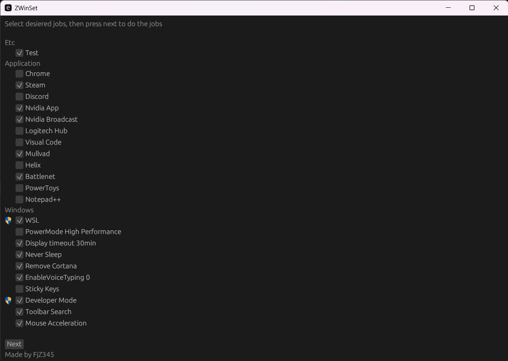
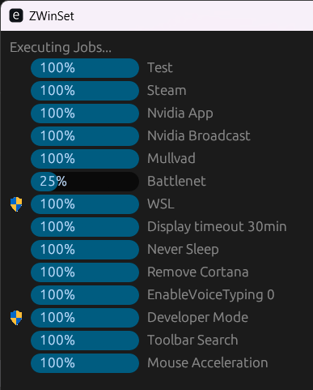

# ZWinSet

  
  

# Disclaimer
I take no responsibility what so ever over you using this tool. Use at own risk.

# Introduction
I am tired of reinstalling all applications and set all 10 windows settings and remove bloat each time I reinstall windows.

This is a multi threaded tool I made to reinstall and setup my windows installation.

It has been tested on Windows 10

## Usage
Follow instructions on screen, steps include:
* Select jobs to execute
* Confirm
* Wait until jobs are done (if require admin, require manual click)

Note that not all jobs are correctly working, check the status of each job in the README.md

# Features
* User friendly GUI
* Multithreading
* Interactive Mode
* User installed identification
* Simple job setup in all_jobs.rs

## Todo
* Automatic usage of "-AllUsers" as launch parameter "r#"Get-AppxPackage -AllUsers -Name Microsoft.549981C3F5F10 | Remove-AppxPackage"#,"
* Might be great to implement some context page for certain jobs where user can specify arguments per job.
* Dependencies (InstallChrome -> Set Chrome default)
* Get the windows topbar height and subtract minscreensize with it
* Verify all jobs
* Better finish screen
* Progress bar somehow more accurate?