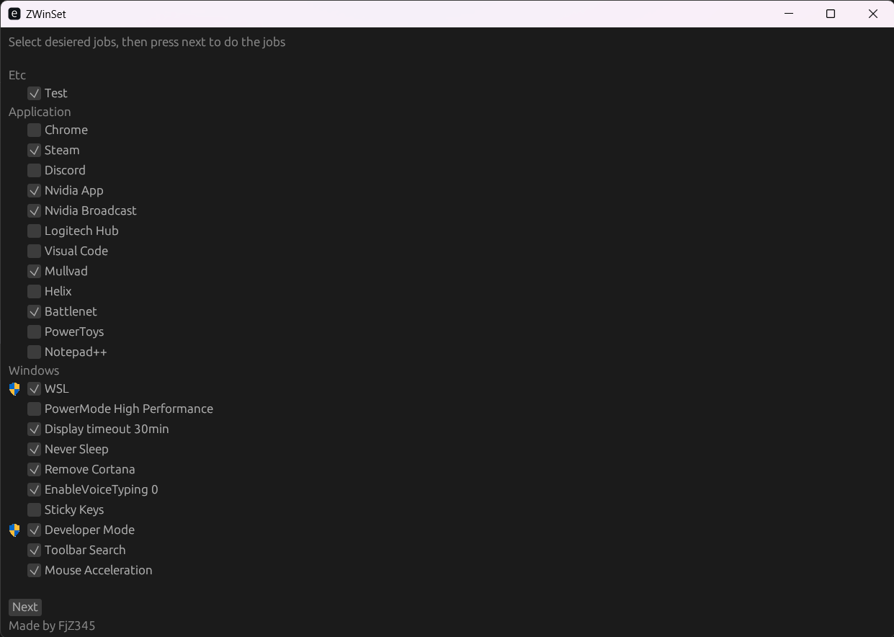
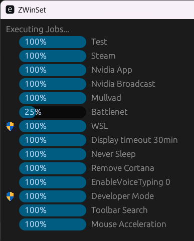

# ZWinSet

  
  

# Disclaimer
I take no responsibility what so ever over you using this tool. Use at own risk.

# Introduction
I am tired of reinstalling all applications and set all 10 windows settings and remove bloat each time I reinstall windows.

This is a multi threaded tool I made to reinstall and setup my windows installation.

It has been tested on Windows 10

## Usage
Follow instructions on screen, steps include:
* Select jobs to execute
* Confirm
* Wait until jobs are done (if require admin, require manual click)

Note that not all jobs are correctly working, check the status of each job in the README.md

# Features
* User friendly GUI
* Multithreading
* Interactive Mode
* User installed identification
* Simple job setup in all_jobs.rs
* "Presets" via selected_jobs.json

## Todo
* Automatic usage of "-AllUsers" as launch parameter "r#"Get-AppxPackage -AllUsers -Name Microsoft.549981C3F5F10 | Remove-AppxPackage"#,"
* Might be great to implement some context page for certain jobs where user can specify arguments per job.
* Dependencies (InstallChrome -> Set Chrome default)
* Get the windows topbar height and subtract minscreensize with it
* Verify all jobs
* Better finish screen
* Progress bar somehow more accurate?
* Allow variable value setting for some settings with enum

### Temp todo
#### MacOS
Disable Spotlight Related Content (web suggestions)
defaults write com.apple.lookup.shared LookupSuggestionsDisabled -bool true

Disable Help apple Improve Search
defaults write com.apple.Safari UniversalSearchEnabled -bool false
defaults write com.apple.Safari SuppressSearchSuggestions -bool true

Disable siri
defaults write com.apple.assistant.support "Assistant Enabled" -bool false
defaults write com.apple.Siri StatusMenuVisible -bool false
launchctl disable user/$(id -u)/com.apple.assistantd

Disable Location Services (protected by System Integrity Protection)
sudo defaults write /var/db/locationd/Library/Preferences/ByHost/com.apple.locationd LocationServicesEnabled -int 0

Disable FN key
defaults write com.apple.HIToolbox AppleFnUsageType -int 0

Show hidden files by default
defaults write com.apple.finder AppleShowAllFiles -bool true

Show path bar in Finder
defaults write com.apple.finder ShowPathbar -bool true

Auto-hide Dock no-delay
defaults write com.apple.dock autohide-delay -float 0

Disable window animations
defaults write NSGlobalDomain NSAutomaticWindowAnimationsEnabled -bool false

Disable telemetry / analytics collection
defaults write com.apple.SubmitDiagInfo AutoSubmit -bool false

Disable auto-correct & smart quotes
efaults write NSGlobalDomain NSAutomaticSpellingCorrectionEnabled -bool false