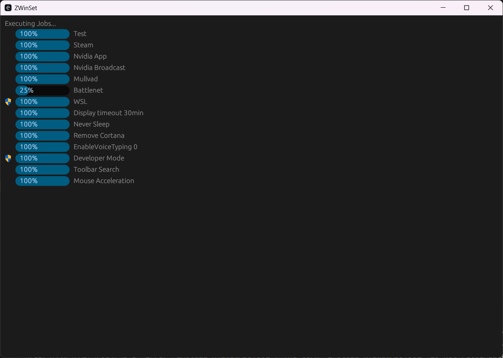

# ZWinSet

# Introduction
I am tired of reinstalling all applications and set all 10 windows settings and remove bloat each time I reinstall windows.

This is a multi threaded tool I made to reinstall and setup my windows installation.

## Usage
Follow instructions on screen, steps include:
* Select jobs to execute
* Confirm
* Wait until jobs are done (if require admin, require manual click)

Note that not all jobs are correctly working, check the status of each job in the README.md

## Todo
* Add remove for -AllUsers as launch parameter "r#"Get-AppxPackage -AllUsers -Name Microsoft.549981C3F5F10 | Remove-AppxPackage"#,", this requires admin privilige
* Interactive testing mode launch parameter
* Dependencies (InstallChrome -> Set Chrome default)
* Better finish screen
* Progress bar somehow more accurate?
* Get the windows topbar height and subtract minscreensize with it

# Stuff to do
* [D] = Done (Not Tested)
* [T] = Tested (Working confirmed)

## Install Applications
* [D] Install Chrome
* [D] nvidia driver
* [D] nvidia broadcast
* [D] logitech
* [D] steam
* [D] discord
* [T] notepad++
* [D] visual code
* [D] helix
* [D] mullvad
* [D] battlenet
* [T] powertoys

* [T] shift spam fix
* [D] wsl
* [T] remove cortana
* [D] developer mode
* [T] power mode performance
* [T] windows power - do not turn off
* [T] mouse acceleration
* [T] remove "searchbar"
* [D] Computer\HKEY_CURRENT_USER\Software\Microsoft\input\Settings EnableVoiceTyping 0

* chrome default browser
* Remove Edge
* remove bing

* FILE EXPLORER
* add file extensions
* add full dir path
* remove history
* remove home
* remove gallery
* unpin Music
* unpin pictures
* unpin videos

* Set in quickbar
* Chrome
* discord
* steam
* position stuff
* remove edge quick bar